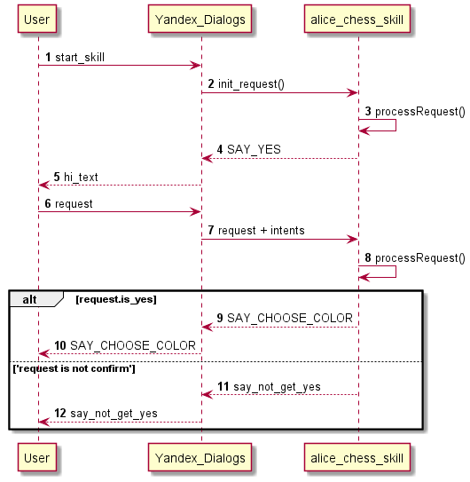

Нарисуем диаграмки для облегчения понимания, чего же делает наш скилл.

## Последовательность вызовов. Приветствие
Начнем с диаграммы последовательностей при приветствии. 
Навык запрашивает подтверждение начала игры и цвет.

На следующих диаграммах раскроем основной процесс игры... Возможно даже в этой жизни

to-do

tbd
