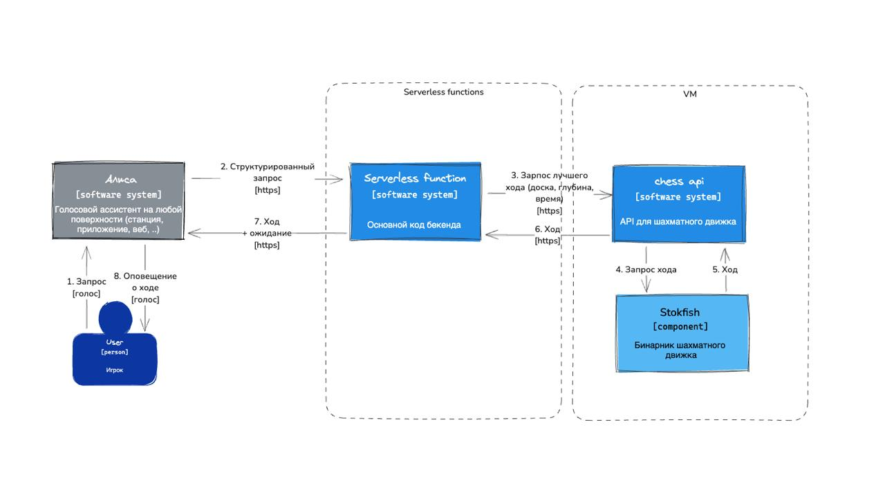

Нарисуем диаграмки для облегчения понимания, чего же делает наш скилл.

## Последовательность вызовов. Приветствие
Рассмотрим диаграмму последовательностей вызовов при обработке поступившего зарпоса. 
Указаны основные моменты обработки запроса без детализации по классам. 

## Диаграмма состояний

Описание статусов:

- INITIATED - начальное состояние
- SAID_HI - приветствие отправлено
- WAITING_CONFIRM - ожидание согласия
- SAID_CONFIRM - пользователь согласился
- WAITING_COLOR - ожидание выбора цвета
- SAID_COLOR - цвет выбран
- WAITING_MOVE - ожидание хода
- SAID_MOVE - ход сделан

## С4 диаграмма уровня 1

