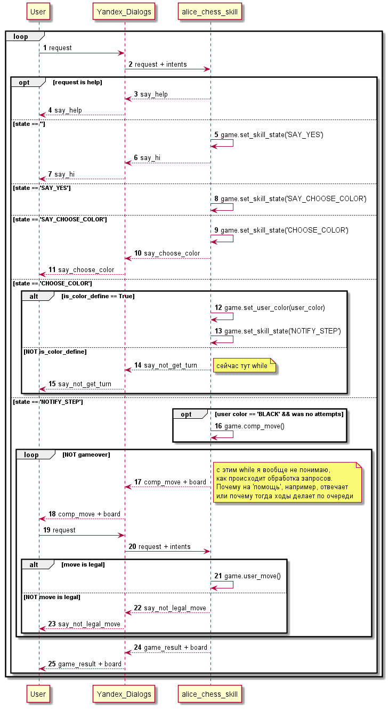

Нарисуем диаграмки для облегчения понимания, чего же делает наш скилл.

## Последовательность вызовов. Приветствие
Рассмотрим диаграмму последовательностей вызовов при обработке поступившего зарпоса. 
Указаны основные моменты обработки запроса без детализации по классам. 

Следующим шагом видится переработка кода + детализация схемы по вызываемым классам