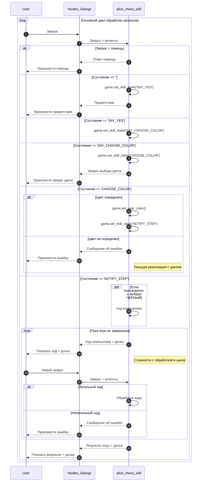

```mermaid
sequenceDiagram
    autonumber
    loop Основной цикл обработки запросов
        User->>Yandex_Dialogs: Запрос
        Yandex_Dialogs->>alice_chess_skill: Запрос + интенты
        
        alt Запрос = помощь
            alice_chess_skill-->>Yandex_Dialogs: Ответ помощи
            Yandex_Dialogs-->>User: Произнести помощь
        else Состояние == ''
            alice_chess_skill->>alice_chess_skill: game.set_skill_state('SAY_YES')
            alice_chess_skill-->>Yandex_Dialogs: Приветствие
            Yandex_Dialogs-->>User: Произнести приветствие
        else Состояние == 'SAY_YES'
            alice_chess_skill->>alice_chess_skill: game.set_skill_state('SAY_CHOOSE_COLOR')
        else Состояние == 'SAY_CHOOSE_COLOR'
            alice_chess_skill->>alice_chess_skill: game.set_skill_state('CHOOSE_COLOR')
            alice_chess_skill-->>Yandex_Dialogs: Запрос выбора цвета
            Yandex_Dialogs-->>User: Произнести запрос цвета
        else Состояние == 'CHOOSE_COLOR'
            alt Цвет определен
                alice_chess_skill->>alice_chess_skill: game.set_user_color()
                alice_chess_skill->>alice_chess_skill: game.set_skill_state('NOTIFY_STEP')
            else Цвет не определен
                alice_chess_skill-->>Yandex_Dialogs: Сообщение об ошибке
                Yandex_Dialogs-->>User: Произнести ошибку
                Note right of alice_chess_skill: Текущая реализация с циклом
            end
        else Состояние == 'NOTIFY_STEP'
            opt Если пользователь выбрал ЧЕРНЫЙ
                alice_chess_skill->>alice_chess_skill: Ход компьютера
            end
            loop Пока игра не завершена
                alice_chess_skill-->>Yandex_Dialogs: Ход компьютера + доска
                Yandex_Dialogs-->>User: Показать ход + доска
                Note right of alice_chess_skill: Сложности с обработкой в цикле
                User->>Yandex_Dialogs: Новый запрос
                Yandex_Dialogs->>alice_chess_skill: Запрос + интенты
                alt Легальный ход
                    alice_chess_skill->>alice_chess_skill: Обработка хода
                else Нелегальный ход
                    alice_chess_skill-->>Yandex_Dialogs: Сообщение об ошибке
                    Yandex_Dialogs-->>User: Произнести ошибку
                end
            end
            alice_chess_skill-->>Yandex_Dialogs: Результат игры + доска
            Yandex_Dialogs-->>User: Показать результат + доска
        end
    end
```