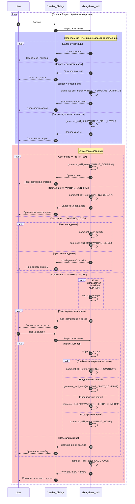

```mermaid
sequenceDiagram
    autonumber
    loop Основной цикл обработки запросов
        User->>Yandex_Dialogs: Запрос
        Yandex_Dialogs->>alice_chess_skill: Запрос + интенты
        
        rect rgb(200, 200, 255)
            Note over alice_chess_skill: Специальные интенты (не зависят от состояния)
            alt Запрос = помощь
                alice_chess_skill-->>Yandex_Dialogs: Ответ помощи
                Yandex_Dialogs-->>User: Произнести помощь
            else Запрос = показать доску
                alice_chess_skill-->>Yandex_Dialogs: Текущая позиция
                Yandex_Dialogs-->>User: Показать доску
            else Запрос = новая игра
                alice_chess_skill->>alice_chess_skill: game.set_skill_state('WAITING_NEWGAME_CONFIRM')
                alice_chess_skill-->>Yandex_Dialogs: Запрос подтверждения
                Yandex_Dialogs-->>User: Произнести запрос
            else Запрос = уровень сложности
                alice_chess_skill->>alice_chess_skill: game.set_skill_state('WAITING_SKILL_LEVEL')
                alice_chess_skill-->>Yandex_Dialogs: Запрос уровня
                Yandex_Dialogs-->>User: Произнести запрос
            end
        end

        rect rgb(255, 200, 200)
            Note over alice_chess_skill: Обработка состояний
            alt Состояние == 'INITIATED'
                alice_chess_skill->>alice_chess_skill: game.set_skill_state('WAITING_CONFIRM')
                alice_chess_skill-->>Yandex_Dialogs: Приветствие
                Yandex_Dialogs-->>User: Произнести приветствие
            else Состояние == 'WAITING_CONFIRM'
                alice_chess_skill->>alice_chess_skill: game.set_skill_state('WAITING_COLOR')
                alice_chess_skill-->>Yandex_Dialogs: Запрос выбора цвета
                Yandex_Dialogs-->>User: Произнести запрос цвета
            else Состояние == 'WAITING_COLOR'
                alt Цвет определен
                    alice_chess_skill->>alice_chess_skill: game.set_user_color()
                    alice_chess_skill->>alice_chess_skill: game.set_skill_state('WAITING_MOVE')
                else Цвет не определен
                    alice_chess_skill-->>Yandex_Dialogs: Сообщение об ошибке
                    Yandex_Dialogs-->>User: Произнести ошибку
                end
            else Состояние == 'WAITING_MOVE'
                opt Если пользователь выбрал ЧЕРНЫЙ
                    alice_chess_skill->>alice_chess_skill: Ход компьютера
                end
                loop Пока игра не завершена
                    alice_chess_skill-->>Yandex_Dialogs: Ход компьютера + доска
                    Yandex_Dialogs-->>User: Показать ход + доска
                    User->>Yandex_Dialogs: Новый запрос
                    Yandex_Dialogs->>alice_chess_skill: Запрос + интенты
                    alt Легальный ход
                        alice_chess_skill->>alice_chess_skill: Обработка хода
                        alt Требуется превращение пешки
                            alice_chess_skill->>alice_chess_skill: game.set_skill_state('WAITING_PROMOTION')
                        else Предложение ничьей
                            alice_chess_skill->>alice_chess_skill: game.set_skill_state('WAITING_DRAW_CONFIRM')
                        else Предложение сдачи
                            alice_chess_skill->>alice_chess_skill: game.set_skill_state('WAITING_RESIGN_CONFIRM')
                        else Игра продолжается
                            alice_chess_skill->>alice_chess_skill: game.set_skill_state('WAITING_MOVE')
                        end
                    else Нелегальный ход
                        alice_chess_skill-->>Yandex_Dialogs: Сообщение об ошибке
                        Yandex_Dialogs-->>User: Произнести ошибку
                    end
                end
                alice_chess_skill->>alice_chess_skill: game.set_skill_state('GAME_OVER')
                alice_chess_skill-->>Yandex_Dialogs: Результат игры + доска
                Yandex_Dialogs-->>User: Показать результат + доска
            end
        end
    end
```