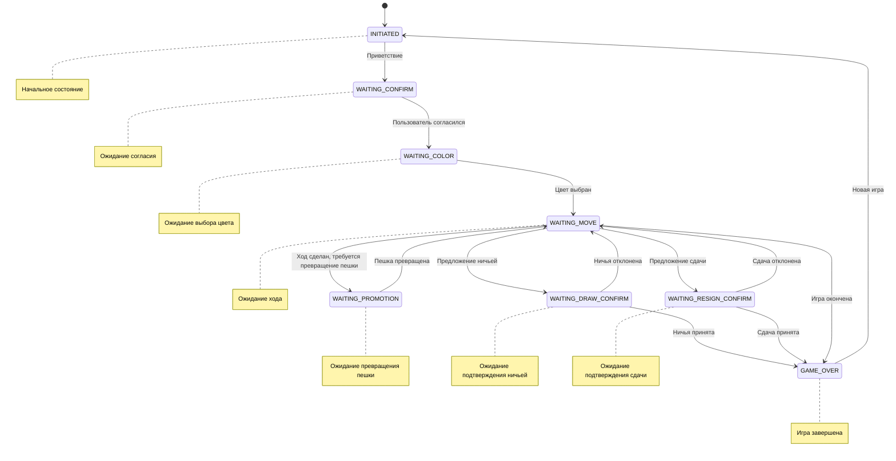

```mermaid
stateDiagram-v2
    [*] --> INITIATED
    INITIATED --> WAITING_CONFIRM: Приветствие
    WAITING_CONFIRM --> WAITING_COLOR: Пользователь согласился
    WAITING_COLOR --> WAITING_MOVE: Цвет выбран
    WAITING_MOVE --> WAITING_PROMOTION: Ход сделан, требуется превращение пешки
    WAITING_PROMOTION --> WAITING_MOVE: Пешка превращена
    WAITING_MOVE --> WAITING_DRAW_CONFIRM: Предложение ничьей
    WAITING_DRAW_CONFIRM --> WAITING_MOVE: Ничья отклонена
    WAITING_DRAW_CONFIRM --> GAME_OVER: Ничья принята
    WAITING_MOVE --> WAITING_RESIGN_CONFIRM: Предложение сдачи
    WAITING_RESIGN_CONFIRM --> WAITING_MOVE: Сдача отклонена
    WAITING_RESIGN_CONFIRM --> GAME_OVER: Сдача принята
    WAITING_MOVE --> GAME_OVER: Игра окончена
    GAME_OVER --> INITIATED: Новая игра

    note right of INITIATED: Начальное состояние
    note right of WAITING_CONFIRM: Ожидание согласия
    note right of WAITING_COLOR: Ожидание выбора цвета
    note right of WAITING_MOVE: Ожидание хода
    note right of WAITING_PROMOTION: Ожидание превращения пешки
    note right of WAITING_DRAW_CONFIRM: Ожидание подтверждения ничьей
    note right of WAITING_RESIGN_CONFIRM: Ожидание подтверждения сдачи
    note right of GAME_OVER: Игра завершена
``` 