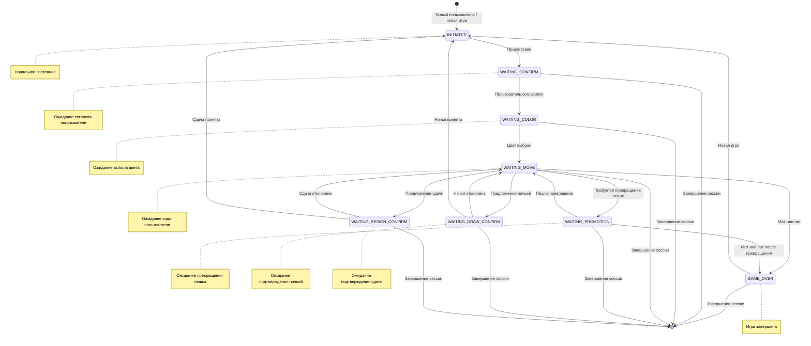

```mermaid
stateDiagram-v2
    [*] --> INITIATED: Новый пользователь / новая игра
    INITIATED --> WAITING_CONFIRM: Приветствие
    WAITING_CONFIRM --> WAITING_COLOR: Пользователь согласился
    WAITING_COLOR --> WAITING_MOVE: Цвет выбран
    WAITING_MOVE --> WAITING_PROMOTION: Требуется превращение пешки
    WAITING_PROMOTION --> WAITING_MOVE: Пешка превращена
    WAITING_MOVE --> WAITING_DRAW_CONFIRM: Предложение ничьей
    WAITING_DRAW_CONFIRM --> WAITING_MOVE: Ничья отклонена
    WAITING_DRAW_CONFIRM --> INITIATED: Ничья принята
    WAITING_MOVE --> WAITING_RESIGN_CONFIRM: Предложение сдачи
    WAITING_RESIGN_CONFIRM --> WAITING_MOVE: Сдача отклонена
    WAITING_RESIGN_CONFIRM --> INITIATED: Сдача принята
    WAITING_MOVE --> GAME_OVER: Мат или пат
    WAITING_PROMOTION --> GAME_OVER: Мат или пат после превращения
    GAME_OVER --> INITIATED: Новая игра
    GAME_OVER --> [*]: Завершение сессии
    WAITING_CONFIRM --> [*]: Завершение сессии
    WAITING_COLOR --> [*]: Завершение сессии
    WAITING_MOVE --> [*]: Завершение сессии
    WAITING_PROMOTION --> [*]: Завершение сессии
    WAITING_DRAW_CONFIRM --> [*]: Завершение сессии
    WAITING_RESIGN_CONFIRM --> [*]: Завершение сессии

    note right of INITIATED: Начальное состояние
    note right of WAITING_CONFIRM: Ожидание согласия пользователя
    note right of WAITING_COLOR: Ожидание выбора цвета
    note right of WAITING_MOVE: Ожидание хода пользователя
    note right of WAITING_PROMOTION: Ожидание превращения пешки
    note right of WAITING_DRAW_CONFIRM: Ожидание подтверждения ничьей
    note right of WAITING_RESIGN_CONFIRM: Ожидание подтверждения сдачи
    note right of GAME_OVER: Игра завершена
``` 