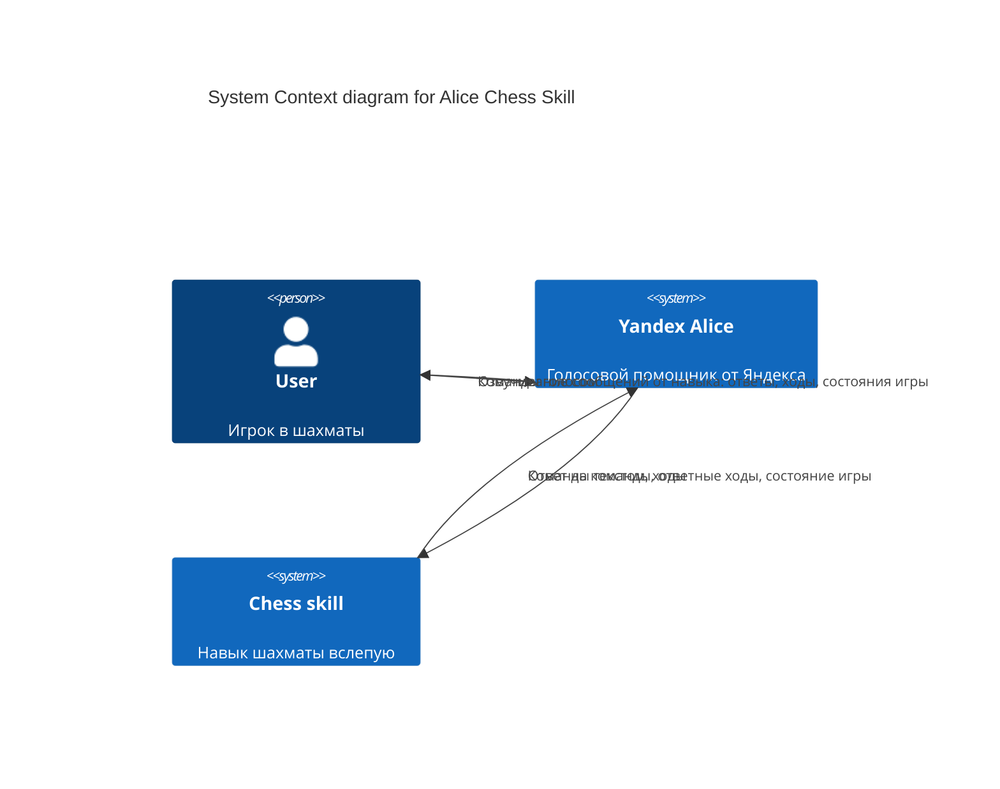
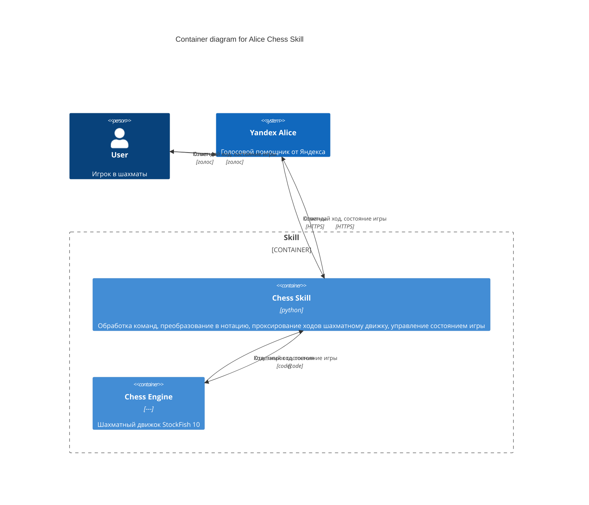
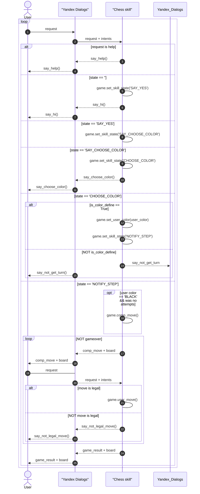

# Оглавление
- [Глоссарий](#glossary)
- [Проблема](#problem)
- [Решение](#solution)
- [Стейкхолдеры](#stakeholders)
- [Сущности предметной области](#er)
- [Бизнес-требования](#brq)
- [Контекстная диаграмма](#context-diagram)
- [Сценарии](#usecases)
- [Функциональные и нефункциональные требования](#fr_nfr)
- [Базовые тесты](#tests)

----

#  Глоссарий
* Алиса - Виртуальный голосовой помощник, созданный компанией Яндекс. 
Распознаёт естественную речь, имитирует живой диалог, даёт ответы на вопросы пользователя и, благодаря запрограммированным навыкам, решает прикладные задачи

#  Проблема
Алиса (помощник Яндекса) не поддерживает возможность играть голосом в шахматы. Голосовые шахматы реализованы у конкурентов, например, Алексы.
При этом, с технической точки зрения реализация не должна быть сложной. 
Игра в шахматы может быть монетизируемой, но пока концепции монетизации не разработано.

#  Решение
Реализовать навык для Алисы, с помощью которого можно играть в шахматы голосом. 
Навык должен быть доступен как на устройствах с экраном, так и без.
Использовать готовый шахматный движок. 
Поддержать один язык: русский. 

#  Стейкхолдеры
Основные классы стейкхолдеров и их интересы:
- Пользователь - кайфануть от игры
- Разработчик - кайфануть от рабочего кода
- Продакт-менеджер - кайфануть от наличия навыка

#  Сущности предметной области

#  Бизнес-требования и ограничения
## User Stories
### US-1
Я, как пользователь, хочу сыграть с Алисой в шахматы голосом в сокращенной шахматной нотации по современным правилам шахмат ФИДЕ

### US-2
Я, как пользователь, хочу сыграть с Алисой в шахматы голосом без экрана, 
чтобы получить удовольствие от игры и развить свои навыки визуализации ситуации на шахматной доске в уме. 

### US-3
Я, как пользователь, хочу сыграть с Алисой в шахматы голосом с экраном, 
чтобы не затруднять мозг визуалиацией ситуации на шахматной доске. Команды отдаю голосом.

### US-4
Я, как создатель навыка, хочу, чтобы навык одновременно выдерживал до 100 партий, 
чтобы обеспечить хороший пользовательский опыт у достаточного количества игроков

## Constrains
### Constr-1
Время ответа навыка должно быть меньше 3 секунд. Ограничение от платформы навыков Алисы

#  Контекстная диаграмма
## C1
Нарисуем диаграмму уровня C1

## C2
Больший интерес может представлять диаграмма уровня C2, отображающая разложение на модули

#  Сценарии
## Диаграмма юзкейсов

## UC1: Поиграть
### Предусловия
### Постусловия
### Основной сценарий
### Альтернативные сценарии
tbd
Типы ходов:
- Обычный ход
- Невозможный ход
- Ход с двумя стартовыми вариантами
- Взятие фигуры соперника
- Превращение пешки
- Шах
- Мат

## UC2: Посмотреть текущую позицию на доске
tbd
## UC3: Отменить последний ход
tbd
## UC4: Сдаться
tbd

## UC5: Изменить уровень сложности - НЕ РЕАЛИЗОВАН
tbd

#  Функциональные и нефункциональные требования
## Функциональные требования
FR-1: Преобразовывать входящий от Алисы текст в команды, понятные движку
tbd
FR-2: 
tbd

## Нефункциональные требования
NFR-1: Юзабилити
tbd

### Возможные состояния навыка
tbd

### Диаграммы последовательностей
#### Последовательность вызовов. Приветствие

Рассмотрим диаграмму последовательностей вызовов при обработке поступившего зарпоса. 
Указаны основные моменты обработки запроса без детализации по классам.

#  Базовые тесты

#  Ссылки
1. [Правила шахмат ФИДЕ](https://handbook.fide.com/chapter/E012018)
2. [Шахматые нотации](https://ru.wikipedia.org/wiki/Шахматная_нотация)
3. [Навык Шахматы вслепую на платформе диалогов Яндекса](https://dialogs.yandex.ru/developer/skills/2310188c-c404-4342-8bbe-d397f25d9de2/)
