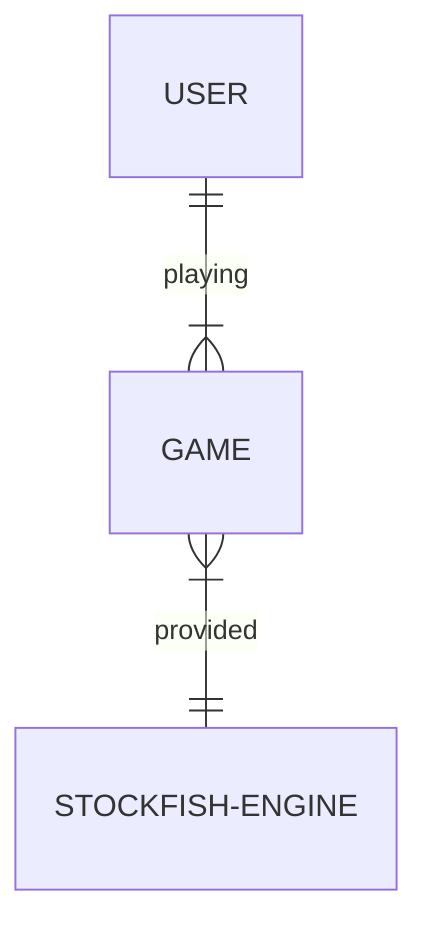
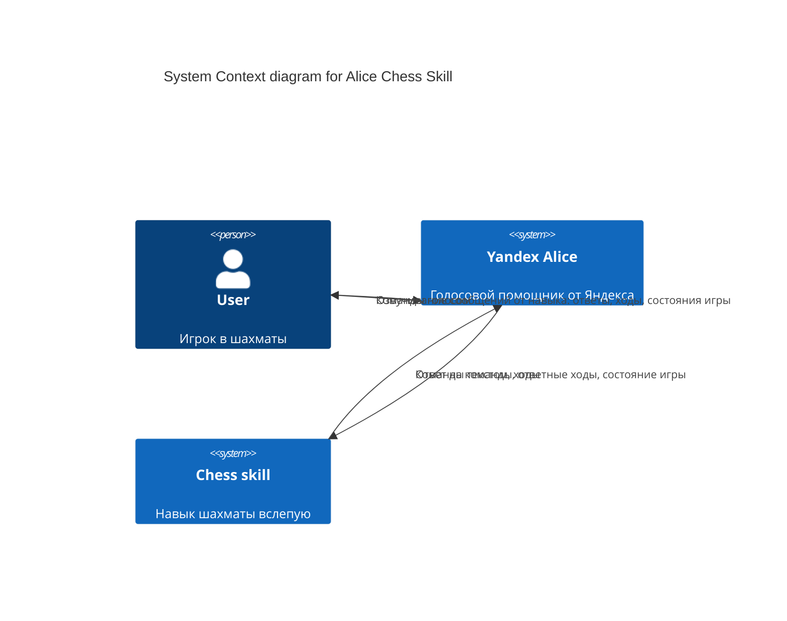
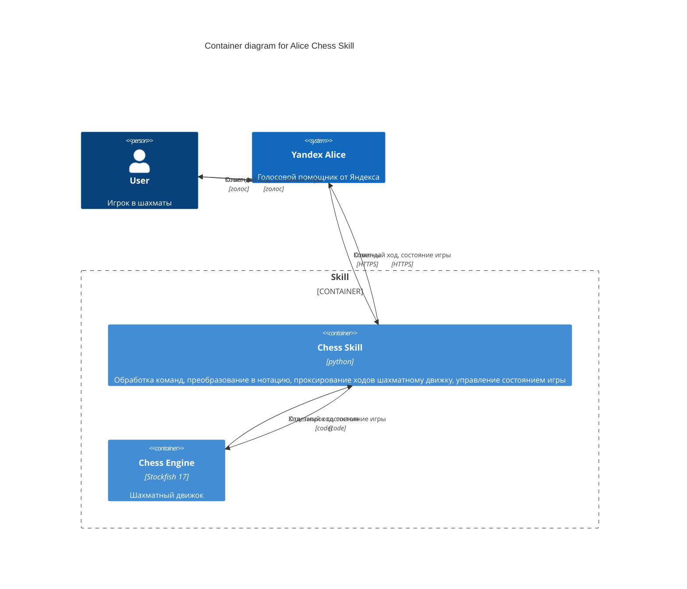

# Оглавление
- [Глоссарий](#glossary)
- [Проблема](#problem)
- [Решение](#solution)
- [Стейкхолдеры](#stakeholders)
- [Сущности предметной области](#er)
- [Бизнес-требования](#brq)
- [Контекстная диаграмма](#context_diagram)
- [Сценарии](#usecases)
- [Функциональные и нефункциональные требования](#fr_nfr)
- [Архитектура](#architecture)
- [API](#api)
- [Деплой](#deployment)
- [Базовые тесты](#tests)
- [Ссылки](#links)

----

# <a name="glossary"></a> Глоссарий
* **Алиса** - Виртуальный голосовой помощник, созданный компанией Яндекс. 
Распознаёт естественную речь, имитирует живой диалог, даёт ответы на вопросы пользователя и, благодаря запрограммированным навыкам, решает прикладные задачи
* **Навык** (син. Диалог) - сценарии, которые разработали компании и пользователи, не имеющие отношения к создателям Алисы.
* **Бессерверная функция** - сервис Яндекс Облака для запуска кода без управления серверами
* **Stockfish** - открытый шахматный движок, используемый для расчета ходов

# <a name="problem"></a> Проблема
Алиса (помощник Яндекса) не поддерживает возможность играть голосом в шахматы. Голосовые шахматы реализованы у конкурентов, например, Алексы.
При этом, с технической точки зрения реализация не должна быть сложной. 
Игра в шахматы может быть монетизируемой, но пока концепции монетизации не разработано.

# <a name="solution"></a> Решение
Реализовать навык для Алисы, с помощью которого можно играть в шахматы голосом. 
Навык должен быть доступен как на устройствах с экраном, так и без.
Использовать готовый шахматный движок Stockfish 17. 
Поддержать один язык: русский. 

# <a name="stakeholders"></a> Стейкхолдеры
Основные классы стейкхолдеров и их интересы:
- Пользователь - кайфануть от игры
- Разработчик - кайфануть от рабочего кода
- Продакт-менеджер - кайфануть от наличия навыка

# <a name="er"></a> Сущности предметной области



# <a name="brq"></a> Бизнес-требования и ограничения
## User Stories
### US-1
Я, как пользователь, хочу сыграть с Алисой в шахматы голосом в сокращенной шахматной нотации по современным правилам шахмат ФИДЕ

### US-2
Я, как пользователь, хочу сыграть с Алисой в шахматы голосом без экрана, 
чтобы получить удовольствие от игры и развить свои навыки визуализации ситуации на шахматной доске в уме. 

### US-3
Я, как пользователь, хочу сыграть с Алисой в шахматы голосом с экраном, 
чтобы не затруднять мозг визуалиацией ситуации на шахматной доске. Команды отдаю голосом.

### US-4
Я, как создатель навыка, хочу, чтобы навык одновременно выдерживал до 100 партий, 
чтобы обеспечить хороший пользовательский опыт у достаточного количества игроков

## Constrains
1. Время ответа навыка должно быть меньше 3 секунд - Ограничение от платформы навыков Алисы
2. Память: 2048MB для тестовой версии, 4096MB для продакшена
3. Python 3.9

# <a name="context_diagram"></a> Контекстная диаграмма
## C1


## C2


# <a name="usecases"></a> Сценарии
## Диаграмма юзкейсов

## UC1: Поиграть
### Предусловия
- Навык запущен
- Пользователь выбрал цвет фигур

### Постусловия
- Игра завершена (мат, пат, ничья или сдача)

### Основной сценарий
1. Пользователь объявляет ход
2. Система проверяет корректность хода
3. Система делает свой ход
4. Система объявляет результат хода
5. Повторять шаги 1-4 до окончания игры

### Альтернативные сценарии
1. Невозможный ход
   - Система сообщает о невозможности хода
   - Пользователь делает другой ход
2. Ход с двумя стартовыми вариантами
   - Система запрашивает уточнение
   - Пользователь уточняет ход
3. Взятие фигуры
   - Система подтверждает взятие
4. Превращение пешки
   - Система запрашивает фигуру для превращения
   - Пользователь выбирает фигуру
5. Шах
   - Система объявляет шах
6. Мат
   - Система объявляет мат
   - Игра завершается

## UC2: Посмотреть текущую позицию на доске
### Предусловия
- Игра идет

### Основной сценарий
1. Пользователь запрашивает позицию
2. Система объявляет текущую позицию

## UC3: Отменить последний ход
### Предусловия
- Игра идет
- Сделан хотя бы один ход

### Основной сценарий
1. Пользователь запрашивает отмену хода
2. Система отменяет последний ход
3. Система объявляет новую позицию

## UC4: Сдаться
### Предусловия
- Игра идет

### Основной сценарий
1. Пользователь объявляет о сдаче
2. Система подтверждает сдачу
3. Игра завершается

## UC5: Изменить уровень сложности
### Предусловия
- Игра идет

### Основной сценарий
1. Пользователь запрашивает изменение уровня
2. Система запрашивает новый уровень (1-20)
3. Пользователь указывает уровень
4. Система подтверждает изменение

# <a name="fr_nfr"></a> Функциональные и нефункциональные требования
## Функциональные требования
FR-1: Преобразовывать входящий от Алисы текст в команды, понятные движку
FR-2: Поддерживать все типы ходов (обычный, взятие, рокировка, превращение)
FR-3: Проверять корректность ходов по правилам шахмат
FR-4: Определять окончание игры (мат, пат, ничья)
FR-5: Поддерживать отмену последнего хода
FR-6: Поддерживать сдачу
FR-7: Поддерживать изменение уровня сложности

## Нефункциональные требования
NFR-1: Юзабилити
- Понятные сообщения об ошибках
- Подсказки при неверных ходах
- Возможность получить помощь в любой момент

NFR-2: Производительность
- Время ответа < 3 секунд
- Поддержка до 100 одновременных игр

NFR-3: Надежность
- Сохранение состояния игры
- Корректная обработка ошибок
- Логирование действий

# <a name="architecture"></a> Архитектура
## Основные компоненты
1. Входные точки
   - `alice_chess.py` - обработчик навыка Алисы
   - `alice_serverless.py` - обработчик бессерверной функции

2. Игровая логика
   - `game.py` - основная логика шахматной игры
   - `move_extractor.py` - обработка и валидация ходов
   - `speaker.py` - генерация текстовых ответов
   - `text_preparer.py` - подготовка текстов

3. Тексты и локализация
   - `texts.py` - текстовые сообщения
   - `intents/` - обработчики намерений

4. Валидация
   - `request_validators/` - валидация запросов
   - `handlers/` - обработчики запросов

## Поток данных
1. Запрос от пользователя через Алису
2. Обработка в `alice_chess.py` или `alice_serverless.py`
3. Валидация через `request_validators/`
4. Обработка через `handlers/`
5. Обработка хода через `move_extractor.py`
6. Игровая логика в `game.py`
7. Генерация ответа через `speaker.py` и `text_preparer.py`
8. Использование текстов из `texts.py`

# <a name="api"></a> API
## Форматы данных
### Входящий запрос
```json
{
    "version": "1.0",
    "session": {
        "session_id": "string",
        "user_id": "string"
    },
    "request": {
        "command": "string",
        "original_utterance": "string",
        "type": "string"
    }
}
```

### Исходящий ответ
```json
{
    "version": "1.0",
    "session": {
        "session_id": "string",
        "user_id": "string"
    },
    "response": {
        "text": "string",
        "end_session": false
    }
}
```

# <a name="deployment"></a> Деплой
## Конфигурация
### Тестовая среда
- Файл: `.github/workflows/yacloud-func-python.yml`
- Триггер: push в master/main или pull request
- Имя функции: `alice-chess-testing`
- Память: 2048MB

### Продакшен среда
- Файл: `.github/workflows/yacloud-func-python prod.yml`
- Триггер: ручной запуск
- Имя функции: `alice-chess-stable`
- Память: 4096MB

## Переменные окружения
- `YC_SA_JSON_CREDENTIALS` - ключ сервисного аккаунта
- `FOLDER_ID` - ID папки в Яндекс Облаке
- `CHESS_API_KEY` - ключ API шахматного движка
- `DEBUG` - режим отладки
- `COUNT` - счетчик запросов

# <a name="tests"></a> Базовые тесты
1. Проверка корректности ходов
2. Проверка обработки ошибок
3. Проверка окончания игры
4. Проверка производительности
5. Проверка интеграции с Алисой

# <a name="links"></a> Ссылки
1. [Правила шахмат ФИДЕ](https://handbook.fide.com/chapter/E012018)
2. [Шахматые нотации](https://ru.wikipedia.org/wiki/Шахматная_нотация)
3. [Навык Шахматы вслепую на платформе диалогов Яндекса](https://dialogs.yandex.ru/developer/skills/2310188c-c404-4342-8bbe-d397f25d9de2/)
4. [Документация Яндекс Облака](https://cloud.yandex.ru/docs/functions/)
5. [Документация Stockfish](https://stockfishchess.org/documentation/)
6. [Документация Яндекс Диалогов](https://yandex.ru/dev/dialogs/alice/doc/)
