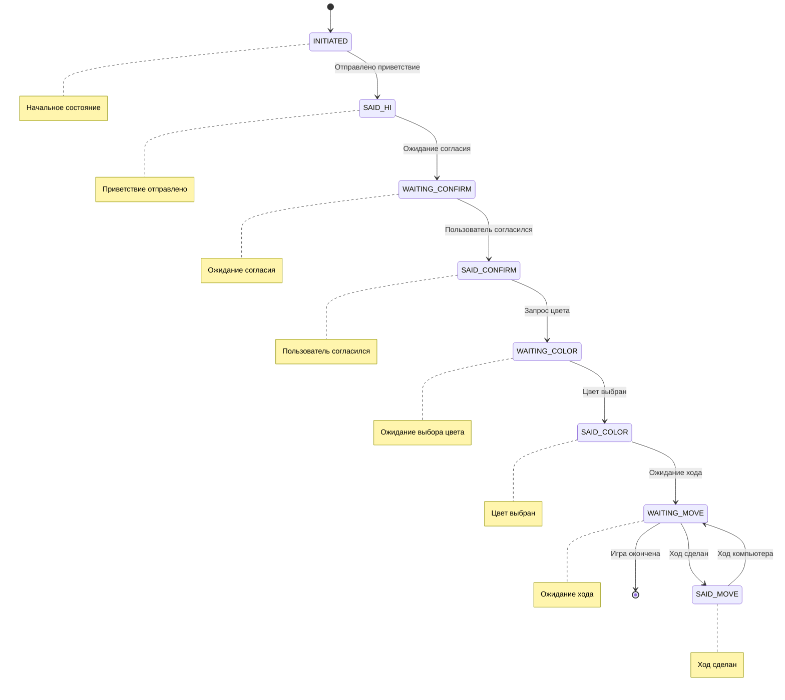

```mermaid
stateDiagram-v2
    [*] --> INITIATED
    INITIATED --> SAID_HI: Отправлено приветствие
    SAID_HI --> WAITING_CONFIRM: Ожидание согласия
    WAITING_CONFIRM --> SAID_CONFIRM: Пользователь согласился
    SAID_CONFIRM --> WAITING_COLOR: Запрос цвета
    WAITING_COLOR --> SAID_COLOR: Цвет выбран
    SAID_COLOR --> WAITING_MOVE: Ожидание хода
    WAITING_MOVE --> SAID_MOVE: Ход сделан
    SAID_MOVE --> WAITING_MOVE: Ход компьютера
    WAITING_MOVE --> [*]: Игра окончена

    note right of INITIATED: Начальное состояние
    note right of SAID_HI: Приветствие отправлено
    note right of WAITING_CONFIRM: Ожидание согласия
    note right of SAID_CONFIRM: Пользователь согласился
    note right of WAITING_COLOR: Ожидание выбора цвета
    note right of SAID_COLOR: Цвет выбран
    note right of WAITING_MOVE: Ожидание хода
    note right of SAID_MOVE: Ход сделан
``` 